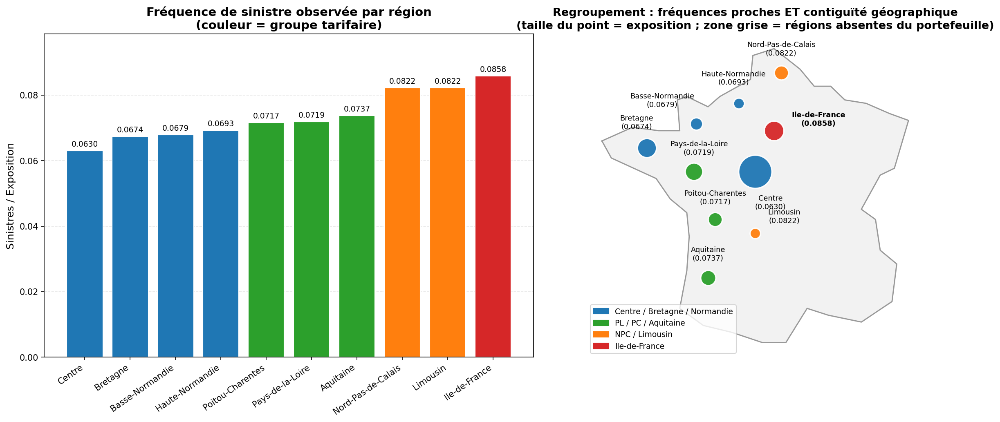

# Tarification automobile Prime pure par GLM & Machine Learning

Construction complète d'un tarif de **prime pure** en assurance automobile (responsabilité civile) sur le portefeuille français **freMTPL** : décomposition fréquence × sévérité par GLM, traitement actuariel des sinistres graves (écrêtement + chargement), puis confrontation à deux approches de machine learning (LightGBM fréquence × sévérité, et modèle Tweedie direct) soumises aux mêmes contraintes actuarielles.

📄 **[Rapport complet (PDF, 17 pages)](rapport/rapport.pdf)** — méthodologie, justification des choix, résultats commentés, limites et pistes d'amélioration.

---

## Résultats clés

Comparaison des quatre tarifs sur le jeu de test (82 634 polices jamais vues) :

| Modèle | Déviance Poisson | Gini | S/P |
|---|:---:|:---:|:---:|
| **GLM fréquence × sévérité** | 0.2582 | **0.191** | 0.923 |
| GLM deux composantes (graves) | 0.2582 | 0.180 | 0.906 |
| ML fréquence × sévérité (écrêté, recalé) | **0.2566** | 0.183 | 0.907 |
| Tweedie direct (recalé) | — | 0.174 | 0.913 |

Trois enseignements :

1. **Le GLM tient tête au machine learning** : meilleur pouvoir de segmentation (Gini), équilibre garanti par construction, interprétabilité totale. Sur un portefeuille de sept variables aux effets essentiellement additifs, le boosting trouve peu d'interactions à exploiter.
2. **La sévérité est quasi non segmentable** : l'early stopping du modèle de sévérité s'arrête après 3 arbres : au-delà de sa moyenne, presque rien n'est généralisable. La segmentation vient de la fréquence.
3. **L'exposition est partiellement endogène au sinistre** (une police résiliée après sinistre cumule exposition courte *et* sinistre) : biais structurel du jeu de données, visible dans le premier décile des tables de lift de tous les modèles.

---

## Points méthodologiques saillants

### Regroupement des régions : fréquence + géographie

Les dix anciennes régions sont regroupées en quatre zones tarifaires sur un **double critère** : proximité des fréquences de sinistre observées *et* contiguïté géographique (cohérence du zonier).



### Sinistres graves : écrêtement + chargement à reconstruction exacte

Le GLM Gamma attritionnel est ajusté sur la sévérité **écrêtée** au quantile 99,5 % (M1 = 40 107 €), et l'excédent des graves est mutualisé via un chargement par sinistre :

```
chargement = P(atypique) × E[excédent | atypique]
           = (n_polices_atypiques / n_sinistres) × 108 716 €  =  523.93 €
```

La convention garantit que la somme des chargements reconstruits **exactement** l'excédent écrêté sur le train. Le chargement représente ~24 % de la prime : un quart du tarif couvre un demi-pour-cent des sinistres.

### ML sous contraintes actuarielles

La comparaison GLM/ML n'est équitable que si le ML respecte les mêmes règles :

- **Exposition** : la fréquence LightGBM régresse le *taux* `ClaimNb/Exposure` pondéré par l'exposition (équivalent de l'offset Poisson) ;
- **Early stopping** sur jeu de validation avec la déviance de la loi correspondante comme métrique (le nombre d'arbres est choisi par les données) ;
- **Écrêtement identique** au GLM pour la sévérité, avec le même chargement ;
- **Contraintes de monotonie** (fréquence croissante avec la densité) — pas d'inversion tarifaire indéfendable ;
- **Recalage global** S/P = 1 sur le train (un GBM ne garantit aucun équilibre agrégé : le Tweedie brut sous-tarife de 29 % sans recalage).

### Interprétabilité

Relativités et grilles tarifaires pour le GLM ; importance par gain, partial dependence plots et **valeurs SHAP** (TreeSHAP natif LightGBM, sans dépendance externe) pour les modèles boostés.

---

## Structure du projet

```
pricing_auto_glm/
├── main.ipynb              # Notebook principal : pipeline complet commenté
├── main.py                 # Version script du pipeline GLM
├── config.py               # Configuration centralisée (seed, split, bins)
│
├── data/
│   ├── raw/                # Données brutes (freMTPL)
│   ├── data_loader.py      # Chargement + agrégation sévérité + cap exposition
│   └── preprocessing.py    # Split anti-fuite, regroupement des modalités
│
├── features/
│   ├── engineering.py      # Discrétisation par quantiles (fit/transform)
│   └── ml_features_engineer.py
│
├── models/
│   ├── frequency_model.py       # GLM Poisson (offset exposition, sélection AIC)
│   ├── severity_model.py        # GLM Gamma (var_weights, sélection AIC)
│   ├── premium_model.py         # Prime pure, S/P, métriques
│   ├── large_claims_model.py    # MEF, seuil M1, écrêtement, chargement, 2 composantes
│   ├── largeClaims_calibrator.py
│   ├── ml_frequency_model.py    # LightGBM Poisson (taux + poids exposition)
│   ├── ml_severity_model.py     # LightGBM Gamma (écrêté, pondéré ClaimNb)
│   ├── ml_tweedie_model.py      # LightGBM Tweedie direct (p = 1.5)
│   └── ml_evaluate.py           # Déviances, Gini/Lorenz, lift, recalage
│
├── pricing/
│   ├── tarif_coefficients.py    # Extraction des coefficients GLM
│   ├── pricing_engine.py        # Prime de référence, prime par profil
│   ├── relativities.py          # Table des relativités
│   └── tarif_grid.py            # Grilles tarifaires croisées
│
├── visualization/
│   ├── config.py                # Thème et palettes
│   ├── eda.py                   # Analyse exploratoire
│   ├── large_claims_plots.py    # MEF, split, écrêtement, décomposition
│   └── ml_plots.py              # Lift, Lorenz, importance, PDP, SHAP
│
├── figures/                # Figures générées par le pipeline
└── rapport/
    ├── rapport.tex         # Source LaTeX du rapport
    └── rapport.pdf         # Rapport compilé (17 pages)
```

## Installation et exécution

### Prérequis

- Python ≥ 3.11
- Dépendances :

```bash
pip install pandas numpy scikit-learn statsmodels lightgbm matplotlib seaborn
```

### Données

Le projet utilise le jeu **freMTPL** (French Motor Third-Party Liability, package R [`CASdatasets`](http://cas.uqam.ca/)) :

- `data/raw/mydata.csv` — table des polices (413 169 lignes : exposition + 7 variables tarifaires), correspond à `freMTPLfreq` ;
- `data/raw/freMTPLsev.csv` — table des sinistres (16 181 lignes : identifiant de police, montant).

### Lancer le pipeline

**Notebook (recommandé)** — pipeline complet avec les sections gros sinistres, ML, Tweedie et comparaison :

```bash
jupyter notebook main.ipynb
```

**Script** — pipeline GLM seul (EDA, fréquence, sévérité, prime pure, moteur tarifaire) :

```bash
python main.py
```

Les figures sont écrites dans `figures/`.

### Recompiler le rapport

```bash
cd rapport
pdflatex rapport.tex && pdflatex rapport.tex   # deux passes (table des matières)
```

---

## Aperçu du tarif GLM

Prime de référence : **188.06 €**. Extraits des relativités combinées (fréquence × sévérité) :

| Facteur | Effet |
|---|---|
| Conducteur 18–32 ans (réf.) vs autres classes | les jeunes paient **plus du double** (rel. 0.45–0.49) |
| Densité classe 5 vs classe 1 | **+40 %** (fréquence +72 %, amortie par la sévérité −19 %) |
| Puissance `i_j_k` vs `d` | **×2.02** |
| Île-de-France vs Centre/Bretagne/Normandie | **−15 %** (fréquence +9 % mais sévérité −23 % : petits chocs urbains) |

L'intérêt de la décomposition fréquence × sévérité apparaît clairement : pour la marque, la région, le carburant et la densité, les deux composantes jouent en **sens opposés** — un modèle du coût total seul manquerait cette structure.

---

## Limites connues et pistes

- Seuil des graves appliqué à la charge **par police** (granularité sinistre indisponible après agrégation) ;
- Hypothèse d'indépendance fréquence–sévérité non testée ;
- Découpage aléatoire unique (pas de validation croisée du pipeline complet ni de validation temporelle) ;
- Pistes : variance power Tweedie par CV, tuning Optuna, GPD sur l'excédent des graves, lissage spatial du zonier, crédibilité pour les petites modalités, modèle de résiliation pour corriger l'endogénéité de l'exposition.

Discussion détaillée au chapitre 11 du [rapport](rapport/rapport.pdf).
